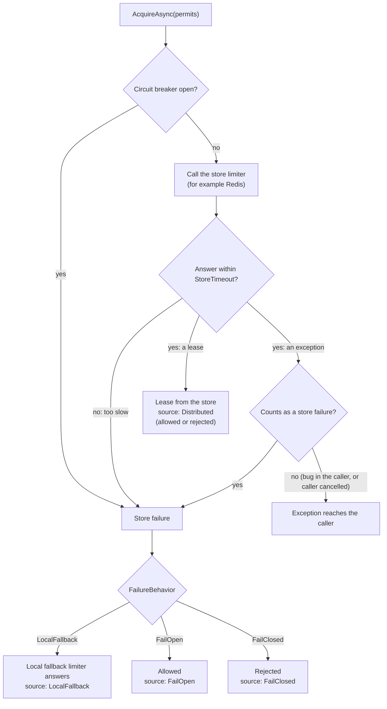

# Concepts

This page teaches the ideas behind the library from zero: what a rate limiter is, why many copies of a service need a shared counter, and what can go wrong when that shared counter is slow or down. Read it before the other pages. Every term in **bold** on first use has an entry in the [Glossary](#glossary) at the end.

## Who this is for

This page is for a .NET developer who has never used `System.Threading.RateLimiting`, Redis or a rate limiter before. If you already know these topics, read [Which limiter should I use?](#which-limiter-should-i-use) and [When the shared store is slow or down](#when-the-shared-store-is-slow-or-down), then go to [02-getting-started.md](02-getting-started.md).

## What a rate limiter does

**The problem.** A web service can answer only so many **requests** in a given time. It has a limited number of CPU cores, database connections and memory. If one client (or a bug in one client, or an attacker) sends far more requests than usual, the service slows down for everybody. In the worst case it stops answering at all.

**What goes wrong without a limit.** Nothing stops the extra traffic. The busy client uses all the capacity, and other clients get slow answers or errors. The service is overloaded even though most clients behave well.

**What a rate limiter does.** A [rate limiter](#rate-limiter) sets a **limit**, for example "at most 100 requests per minute" (an example number, not a recommendation). Before your code handles a request, it asks the limiter: "may I handle this one?" The limiter counts, and says yes while the count is under the limit and no after that. Rejected requests are cheap: your code does not do the real work for them. So the rate limiter protects the service from overload.

Three words appear everywhere in rate limiting:

- A [permit](#permit) is one unit of the limit. Usually one request costs one permit. A limit of 100 permits per minute means 100 requests per minute.
- To ask the limiter, you call [`AcquireAsync`](#acquireasync) with the number of permits you need.
- The limiter answers with a [lease](#lease). A lease is the answer object: its `IsAcquired` property says "allowed" (`true`) or "rejected" (`false`). A lease can also carry [metadata](#metadata): extra facts about the answer, for example how long the caller should wait before it tries again (the [Retry-After](#retry-after-header) value). You dispose the lease when the request is finished.

.NET has this model built in. The `System.Threading.RateLimiting` namespace defines the base class `RateLimiter`, the `RateLimitLease` class, and ready limiters that count in memory. ASP.NET Core uses the same types in its rate limiting middleware (`AddRateLimiter` and `UseRateLimiter`). This library also uses the same types, so everything on this page applies to it.

Here is a complete example with a built-in limiter. The limit is 2 requests per minute, and the code sends 3 requests:

<!-- snippet: built-in-limiter -->
```csharp
using var limiter = new FixedWindowRateLimiter(new FixedWindowRateLimiterOptions
{
    PermitLimit = 2,
    Window = TimeSpan.FromMinutes(1),
    QueueLimit = 0,
});

for (var request = 1; request <= 3; request++)
{
    using var lease = await limiter.AcquireAsync(permitCount: 1);

    if (lease.IsAcquired)
    {
        Console.WriteLine($"Request {request}: allowed");
    }
    else
    {
        lease.TryGetMetadata(MetadataName.RetryAfter, out var retryAfter);
        Console.WriteLine($"Request {request}: rejected, retry after {retryAfter}");
    }
}
```
From `samples/ResilientRateLimiting.Samples.Console/Scenarios.cs`

When you run the console sample, it prints:

```text
Request 1: allowed
Request 2: allowed
Request 3: rejected, retry after 00:01:00
```

`QueueLimit = 0` means "do not wait". A limiter can also hold a request in a [queue](#queue) until a permit is free. With a queue limit of zero, a request over the limit is rejected at once. Most services that protect themselves from overload want this: a waiting request still holds a connection and memory.

## Kinds of limiter

A limiter must decide *when* used permits come back. There are four common answers, and `System.Threading.RateLimiting` has one class for each.

- **[Fixed window](#fixed-window)** (`FixedWindowRateLimiter`). Time is cut into equal blocks, for example one minute each. Each block allows up to the limit. When a new block starts, the count goes back to zero. Example: "100 requests per minute, the count resets at the start of each minute." It is simple and uses little memory. Its weak point: a client can send 100 requests at the end of one minute and 100 more at the start of the next, so 200 requests arrive within a few seconds.
- **[Sliding window](#sliding-window)** (`SlidingWindowRateLimiter`). The window moves with time: "at most 100 requests in *any* 60 seconds". The built-in class splits the window into [segments](#segment) (for example 6 segments of 10 seconds). When a segment grows older than the window, its permits come back. This removes most of the burst at the window edge, and it costs a little more memory.
- **[Token bucket](#token-bucket)** (`TokenBucketRateLimiter`). Picture a bucket that holds up to a fixed number of tokens. Each request takes a token. At a fixed period, a fixed number of tokens is added back, never more than the bucket holds. Example: "a bucket of 20 tokens; 10 tokens are added every second." This allows a short burst (up to 20 at once) but a steady rate of 10 per second over time.
- **[Concurrency](#concurrency-limiter)** (`ConcurrencyLimiter`). This one does not count requests over time. It counts requests *running at the same time*. Example: "at most 5 requests in progress." A permit comes back as soon as its lease is disposed, that is, when the request finishes. It protects a resource that can do only a few things at once, for example a slow downstream system.

| Kind | What it counts | When permits come back |
|---|---|---|
| Fixed window | Requests in the current block of time | All at once, when the next block starts |
| Sliding window | Requests in the last full window | Segment by segment, as each segment grows older than the window |
| Token bucket | Tokens left in the bucket | A fixed number of tokens every period, up to the bucket size |
| Concurrency | Requests in progress right now | Each one when its lease is disposed |

One example of each (all numbers are examples):

<!-- snippet: limiter-kinds -->
```csharp
// At most 100 requests in each fixed minute (10:00:00-10:00:59, then 10:01:00-10:01:59, ...).
using var fixedWindow = new FixedWindowRateLimiter(new FixedWindowRateLimiterOptions
{
    PermitLimit = 100,
    Window = TimeSpan.FromMinutes(1),
});

// At most 100 requests in any rolling minute, tracked in 6 segments of 10 seconds.
using var slidingWindow = new SlidingWindowRateLimiter(new SlidingWindowRateLimiterOptions
{
    PermitLimit = 100,
    Window = TimeSpan.FromMinutes(1),
    SegmentsPerWindow = 6,
});

// A bucket of 20 tokens; 10 tokens are added back every second.
using var tokenBucket = new TokenBucketRateLimiter(new TokenBucketRateLimiterOptions
{
    TokenLimit = 20,
    TokensPerPeriod = 10,
    ReplenishmentPeriod = TimeSpan.FromSeconds(1),
});

// At most 5 requests running at the same time; a permit comes back when its lease is disposed.
using var concurrency = new ConcurrencyLimiter(new ConcurrencyLimiterOptions
{
    PermitLimit = 5,
});
```
From `samples/ResilientRateLimiting.Samples.Console/Scenarios.cs`

The difference between the first three kinds and the concurrency kind matters later in this library. A window or token bucket *remembers recent traffic*: after 100 requests it still knows about them for the rest of the window. A concurrency limiter forgets a request the moment the request ends. That is why this library's local fallback limiter must be a window or token-bucket limiter, never a `ConcurrencyLimiter` (see [When the shared store is slow or down](#when-the-shared-store-is-slow-or-down)).

## Partitions

**The problem.** One limit for the whole service is rarely what you want. If the service allows 1,000 requests per minute in total, one noisy client can use all 1,000, and every other client is rejected.

**What goes wrong without partitions.** The limit protects the service, but not the clients from each other. A well-behaved client is rejected because of somebody else's traffic.

**What partitions do.** A [partition](#partition) is a separate limiter for each [partition key](#partition-key). The key is a value you take from the request: a client ID, an API key, a tenant ID, or a user ID. "100 requests per minute *per client*" means one counter for client A, another for client B, and so on. Client A reaching its limit does not affect client B.

.NET builds this with `PartitionedRateLimiter`. You give it a function that reads the key from the request and says which limiter that key uses. It creates the limiter for a key the first time the key appears, and keeps it for later requests with the same key.

<!-- snippet: built-in-partitioned -->
```csharp
using var limiter = PartitionedRateLimiter.Create<string, string>(clientId =>
    RateLimitPartition.GetFixedWindowLimiter(clientId, _ => new FixedWindowRateLimiterOptions
    {
        PermitLimit = 1,
        Window = TimeSpan.FromMinutes(1),
        QueueLimit = 0,
    }));

using var first = await limiter.AcquireAsync("client-a");
using var second = await limiter.AcquireAsync("client-a");
using var other = await limiter.AcquireAsync("client-b");

Console.WriteLine($"client-a first: {first.IsAcquired}, client-a second: {second.IsAcquired}, client-b: {other.IsAcquired}");
```
From `samples/ResilientRateLimiting.Samples.Console/Scenarios.cs`

It prints `client-a first: True, client-a second: False, client-b: True`: client A used its one permit, and client B still has its own.

**Why the key matters.** The key decides who shares a limit. Choose it with care:

- A key that is too wide (for example, one key for all anonymous users) puts many clients into one counter. They block each other.
- A key that is too narrow (for example, a new random value per request) gives every request its own counter. Nothing is limited, and memory grows with each new key.
- Each active key costs memory. This library's cost per partition is about 1 KB (**measured**, see [measurements.md](measurements.md#memory-per-partition)).

This library has its own helper for partitions, `ResilientRateLimitPartition.Get`. [03-api-reference.md](03-api-reference.md) explains it.

## One replica or many

**The problem.** Production services usually run more than one copy of the same program, to handle more traffic and to stay up when one copy fails. Each copy is called a [replica](#replica) (or an instance, or a pod in Kubernetes). A load balancer spreads requests over the replicas.

**What goes wrong with in-memory limiters.** The built-in limiters count in the memory of their own process. Each replica has its own counter and does not know what the other replicas counted. So a limit of "100 requests per minute" becomes 100 per minute *per replica*. With 3 replicas, a client can send up to 300 requests per minute. With 10 replicas, up to 1,000. The real limit grows each time you add a replica, and it changes when an autoscaler adds or removes replicas.

**The shared counter.** The fix is to keep the count in one place that all replicas can reach: a [shared counter](#shared-counter). Each replica asks the same counter, so the limit is the same no matter how many replicas run. The place that holds the shared counter is called the [store](#store) in this documentation.

**Redis.** [Redis](#redis) is the store most often used for this. Redis is a separate server program that keeps data in memory and answers over the network very fast (well under a millisecond on a local machine, **measured**, see [measurements.md](measurements.md#store-round-trip)). It can run a small script as one step that no other client can interrupt, so two replicas that count at the same moment cannot both see the old value. Cloud providers sell Redis as a managed service.

**RedisRateLimiting.** [RedisRateLimiting](#redisratelimiting) is an open-source NuGet package (not part of this library) that implements the .NET `RateLimiter` base class on top of Redis. It has `RedisFixedWindowRateLimiter`, `RedisSlidingWindowRateLimiter`, `RedisTokenBucketRateLimiter` and `RedisConcurrencyRateLimiter`. Because they are normal `RateLimiter` objects, you call `AcquireAsync` and read a lease as with the built-in limiters. The difference is that each call goes over the network to Redis.

That network call is also the weak point. A counter in local memory never fails to answer. A counter in another server can be slow, unreachable or down. The rest of this page is about that problem.

## Which limiter should I use?

You have five realistic choices. This table compares them, and a paragraph for each row follows.

| Option | What it gives | Pick it when |
|---|---|---|
| Built-in .NET limiters (`System.Threading.RateLimiting`, ASP.NET Core `AddRateLimiter`) | In-memory counting per process; no dependency; no network | One instance, or a per-replica limit is acceptable (the effective global limit then grows with the replica count) |
| `RedisRateLimiting` alone | One shared count across all replicas, stored in Redis | Many replicas must share one limit, and you accept what happens when Redis is slow or down (every request waits for or fails with Redis) |
| `ResilientRateLimiting` (core) + `RedisRateLimiting` | The shared count, plus timeout, circuit breaker, a chosen outage behaviour (local fallback / fail-open / fail-closed), recovery after an outage, source tag, metrics, Retry-After | Many replicas share a limit and a Redis problem must not become an outage or a flood |
| `ResilientRateLimiting.AspNetCore` on top | 429 + `Retry-After` defaults, degraded header, DI registration from configuration, logging | The limiter protects an ASP.NET Core app |
| None of these | — | Daily/monthly quotas, billing entitlements: use the business database |

**Built-in .NET limiters.** They count in the memory of each process. They need no extra server and no network call, so they are fast and they cannot fail because of another system. Use them when you run one instance. Use them also with many replicas if a limit per replica is good enough, for example when the only goal is to stop one replica from being overloaded. Remember that the total limit is then the per-replica limit times the number of replicas, and it changes when the replica count changes.

**`RedisRateLimiting` alone.** All replicas share one count in Redis, so the limit is the same for 1 replica or 20. The price is that every request now depends on Redis. We checked what happens when Redis cannot be reached (**measured** in this project on 2026-09-24; setup: `RedisRateLimiting` 1.2.1, StackExchange.Redis 2.9.11 with its default settings, `RedisSlidingWindowRateLimiter`, Redis 7 in local Docker, .NET 10 on Windows). Two cases were tried: nothing listening on the Redis port from the start, and a Redis container that answered normally and was then stopped. In both cases, each `AcquireAsync` call waited about 5 seconds (between 4,989 and 6,013 ms over 6 calls) and then threw `StackExchange.Redis.RedisConnectionException` ("The message timed out in the backlog attempting to send because no connection became available (5000ms)"). No lease came back. The 5 seconds is the Redis client's own default timeout, and the wait repeats for every request, because nothing remembers that Redis is down. So during a Redis outage every request waits about 5 seconds and then fails with an exception that your code must handle. In an ASP.NET Core app, an exception that nothing catches becomes an error response for the client (this last step was not measured here). Pick this option only if you accept that behaviour.

**`ResilientRateLimiting` core with `RedisRateLimiting`.** This library wraps the Redis limiter. The Redis limiter is still the one that counts, and on a normal day the answer is exactly the Redis answer. The library adds what happens around the call: a short **store timeout** (20 ms by default, a **starting point**, see [measurements.md](measurements.md#store-round-trip)), a **circuit breaker** that stops calling Redis for a while after repeated failures, and one outage behaviour that you choose. It also handles recovery after an outage, tags each lease with the path that answered, reports metrics, and computes a Retry-After value. Pick it when many replicas must share a limit and a Redis problem must turn neither into an outage (every request fails) nor into a flood (every request is allowed with no limit). The library counts nothing itself and depends on no Redis client: the core package references only `System.Threading.RateLimiting` and `Polly.Core`. Any `RateLimiter` that keeps its count in a store can be the primary. Redis through `RedisRateLimiting` is the one this project tests.

**`ResilientRateLimiting.AspNetCore` on top.** A second, small package for ASP.NET Core apps. It sets the rejection status code to 429 ("Too Many Requests"), writes the `Retry-After` header from the lease, can add an `X-RateLimit-Degraded: true` header to a rejection so the client knows a degraded path answered, registers the shared parts in dependency injection from your configuration, and logs store failures. Pick it when the limiter protects an ASP.NET Core app. [02-getting-started.md](02-getting-started.md) shows it.

**None of these.** A rate limiter is for overload protection: windows of seconds to minutes. It is not the right tool for daily or monthly quotas, or for what a customer has paid for. Those counts must survive restarts, must never reset by surprise, and often need an audit trail. Keep them in your business database, next to your authorization rules. [Choosing a window length](#choosing-a-window-length) explains why long windows are weak on both the local and the Redis side.

## When the shared store is slow or down

**What the caller sees without this library.** As measured in the previous section, a plain Redis limiter makes each request wait for the Redis client's timeout (about 5 seconds with default settings) and then throws. A slow Redis is similar: each request waits as long as Redis takes. Your service is now as available as Redis is. A limiter that was meant to protect the service has become a way to take it down.

**Three possible answers.** When the store does not answer, the limiter must still answer the request. There are only three sensible answers, and each has a risk. This library calls the choice [`StoreFailureBehavior`](#storefailurebehavior), and you set it per limiter:

| Behaviour | What happens during the outage | Risk |
|---|---|---|
| [Local fallback](#local-fallback) (`LocalFallback`, the default) | Each replica counts in its own memory, with a smaller limit, until the store is back | The total limit is only approximate: it depends on how many replicas run and how evenly traffic spreads over them |
| [Fail open](#fail-open) (`FailOpen`) | Every request is allowed | No limit at all while the store is down. A traffic spike during a Redis outage reaches your service unchecked |
| [Fail closed](#fail-closed) (`FailClosed`) | Every request is rejected | Your service is down for all clients while the store is down, even though the service itself is healthy |

**Local fallback** is the default because it keeps both properties roughly true: the service stays up, and traffic stays limited. The [local budget](#local-budget) for each replica is usually the shared limit divided by the typical replica count, rounded up. For example, a shared limit of 100 with 3 replicas gives each replica 34 (example numbers). The fallback limiter must be a window or token-bucket limiter. It cannot be a `ConcurrencyLimiter`, because a concurrency limiter gives its permit back when the lease ends, so it cannot remember recent traffic. A concurrency limiter can still be the primary with `FailOpen` or `FailClosed`.

**How the library notices a problem.** A store call counts as a [store failure](#store-failure) when:

- the store does not answer within the [store timeout](#store-timeout) (`StoreHealthOptions.StoreTimeout`, 20 ms by default, a **starting point**). The library stops waiting and answers from the configured behaviour at once; it does not wait for the Redis client's 5 seconds;
- the [circuit breaker](#circuit-breaker) is open. After enough recent calls have failed, the library stops calling the store for a while and treats each request as a store failure without any network call. [The circuit breaker](#the-circuit-breaker) explains when it opens and closes;
- the store limiter throws an exception that counts as a store failure, for example the `RedisConnectionException` above. By default, `ArgumentException`, `ObjectDisposedException` and `InvalidOperationException` are treated as bugs in the calling code and reach the caller; other exceptions count as store failures. You can change this rule with `StoreHealthOptions.ShouldHandle`.

A cancellation by the caller (the `CancellationToken` you pass to `AcquireAsync`) is never a store failure. It reaches the caller as a normal cancellation.

When the store answers in time, its answer is used as it is, allowed or rejected. A rejection by the store is a normal answer, not a failure.

**The source tag.** Every lease from this library says which path produced it. This is the [source tag](#source-tag), a `LeaseSource` value in the lease metadata: `Distributed` (the store answered), `LocalFallback`, `FailOpen`, `FailClosed`, or `Recovery` (the store is back, but the local counter answered; see [Recovery after an outage](#recovery-after-an-outage)). Your code, your metrics and your logs can tell a normal answer from a degraded one.



This flowchart leaves out one step. With `LocalFallback`, for a short time after an outage ends, the local counter is asked before the store; a refusal there has the source `Recovery`. [Recovery after an outage](#recovery-after-an-outage) explains why.

Choosing the behaviour takes one option. With `FailOpen`, no fallback limiter is needed:

<!-- snippet: fail-open -->
```csharp
var options = new ResilientRateLimiterOptions { FailureBehavior = StoreFailureBehavior.FailOpen };

using var limiter = primary.WithResilience(fallback: null, options, storeHealth);
```
From `samples/ResilientRateLimiting.Samples.Console/Scenarios.cs`

[02-getting-started.md](02-getting-started.md) builds a complete limiter with a local fallback. [04-configuration.md](04-configuration.md) explains every option.

## Glossary

### AcquireAsync

The method you call on a `RateLimiter` to ask for permits: `AcquireAsync(permitCount, cancellationToken)`. It returns a [lease](#lease). With this library, always use `AcquireAsync`; the synchronous `AttemptAcquire` always rejects, because it does not call the store.

### Circuit breaker

A guard that stops calling a store that keeps failing. After enough recent calls fail, it "opens" and every call counts as a [store failure](#store-failure) at once, with no network call. After a set time it lets calls through again to test the store. See [The circuit breaker](#the-circuit-breaker).

### Concurrency limiter

A limiter that counts requests in progress at the same time, not requests over time. A permit comes back when its lease is disposed. In .NET: `ConcurrencyLimiter`.

### Fail closed

The outage behaviour that rejects every request while the store is failing. Safe for the protected resource; the service is unavailable to clients during the outage.

### Fail open

The outage behaviour that allows every request while the store is failing. The service stays available; there is no limit during the outage.

### Fixed window

A limiter that cuts time into equal blocks and allows up to the limit in each block. The count resets when the next block starts. In .NET: `FixedWindowRateLimiter`.

### Lease

The answer from a rate limiter. `IsAcquired` is `true` when the request is allowed. A lease can carry [metadata](#metadata). Dispose it when the request is finished.

### Limit

The largest number of [permits](#permit) a limiter hands out in its window, bucket or at one time. For example, `PermitLimit = 100`.

### Local budget

The limit each replica's [local fallback](#local-fallback) limiter uses during an outage: usually the shared limit divided by the typical replica count, rounded up. `LocalBudget.ForReplicas` computes it.

### Local fallback

The default outage behaviour: each replica answers from its own in-memory limiter, with a smaller limit, while the store is failing. The source tag is `LocalFallback`.

### Metadata

Extra facts attached to a [lease](#lease), read with `lease.TryGetMetadata(...)`. Examples: the [Retry-After](#retry-after-header) value, and this library's [source tag](#source-tag).

### Partition

A separate limiter for each [partition key](#partition-key), so that each client or tenant has its own count. In .NET: `PartitionedRateLimiter`.

### Partition key

The value that decides which [partition](#partition) a request belongs to, for example a client ID or tenant ID.

### Permit

One unit of a limit. Usually one request costs one permit.

### Queue

A waiting line inside a limiter. With `QueueLimit` above zero, a request over the limit can wait for a permit instead of being rejected at once. `QueueLimit = 0` means reject at once.

### Rate limiter

A component that decides whether a request may go ahead, by counting requests against a [limit](#limit). In .NET, the base class is `RateLimiter` in `System.Threading.RateLimiting`.

### Redis

A separate server program that keeps data in memory and answers over the network very fast. Many replicas can share one Redis, which makes it a common [store](#store) for a [shared counter](#shared-counter).

### RedisRateLimiting

An open-source NuGet package, separate from this library, that implements .NET `RateLimiter` classes on top of [Redis](#redis): `RedisFixedWindowRateLimiter`, `RedisSlidingWindowRateLimiter`, `RedisTokenBucketRateLimiter` and `RedisConcurrencyRateLimiter`.

### Replica

One running copy of your service. Production services often run several replicas behind a load balancer.

### Retry-After header

An HTTP response header that tells the client how long to wait before it tries again. A limiter can put this value into the [lease](#lease) metadata (`MetadataName.RetryAfter`).

### Segment

One part of a [sliding window](#sliding-window). When a segment grows older than the window, the permits counted in it come back.

### Shared counter

One count that all [replicas](#replica) read and update, kept in a [store](#store), so the limit stays the same no matter how many replicas run.

### Sliding window

A limiter that allows up to the limit in any window of the given length, not only in fixed blocks. In .NET: `SlidingWindowRateLimiter`.

### Source tag

The `LeaseSource` value this library puts in every lease's metadata. It says which path answered: `Distributed`, `LocalFallback`, `FailOpen`, `FailClosed` or `Recovery`.

### Store

The external system that holds the [shared counter](#shared-counter), usually [Redis](#redis). The store limiter (also called the primary limiter) is the `RateLimiter` that talks to it.

### Store failure

A store call that did not give a usable answer: it was slower than the [store timeout](#store-timeout), the [circuit breaker](#circuit-breaker) was open, or the store limiter threw an exception that counts as a failure. A store failure sends the request to the configured [outage behaviour](#storefailurebehavior).

### Store timeout

How long the library waits for the store before it treats the call as a [store failure](#store-failure): `StoreHealthOptions.StoreTimeout`, 20 ms by default (a starting point).

### StoreFailureBehavior

The option that chooses what happens during a [store failure](#store-failure): `LocalFallback` (the default), `FailOpen` or `FailClosed`.

### Token bucket

A limiter with a bucket of tokens. Each request takes tokens, and a fixed number is added back each period, up to the bucket size. In .NET: `TokenBucketRateLimiter`.

Next: [02-getting-started.md](02-getting-started.md)
